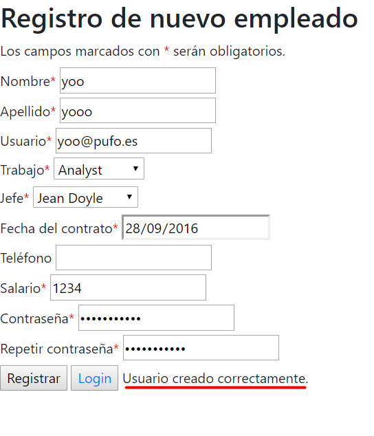
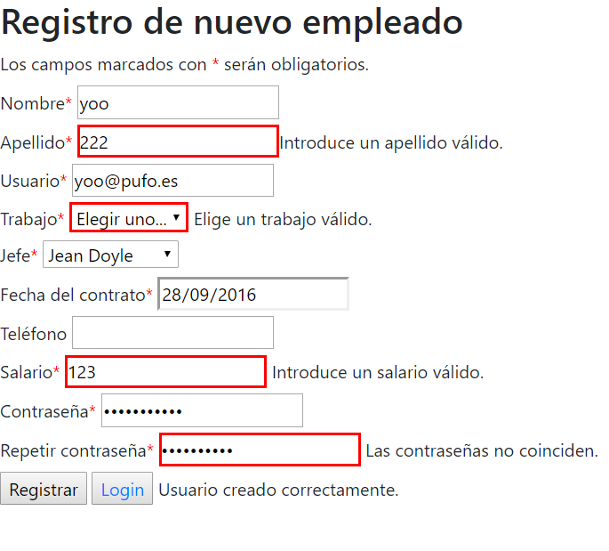
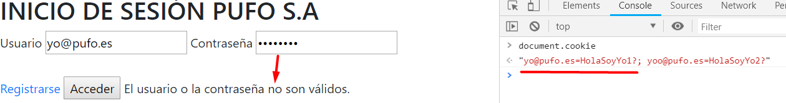
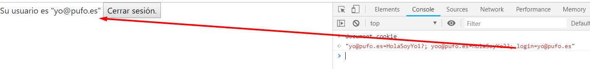

# FormularioPufoSA

El proyecto tiene 3 componentes, un registro, un login y un menú principal.

Cuando entremos a la aplicación nos mandará directamente al login en caso de que tengamos usuario,
si no podemos darle al botón de registrar y nos mandará al formulario.

Este tiene algunos campos obligatorios y otros opcionales, a medida que vayamos introduciendo valores se comprobará automáticamente si 
los valores con válidos o no y nos informará de ello. Una vez todos los datos sean correctos y le demos al botón de registrar se creará una cookie
donde la clave será el usuario y el valor la contraseña para poder acceder con esos datos en el login.

Una vez creado el usuario podemos volver al login pulsando el botón e introducir el usuario y la contraseña. Si los valores coinciden 
con los datos registrados se creará una cookie de sesion para ese mismo usuario. En caso de que los valores no estén registrados nos informará
de ello.

Dentro del menú simplemente podemos ver nuestro usuario y un botón de cerrar sesión, que borrará la cookie de sesión creada y nos enviará al login
de nuevo.

